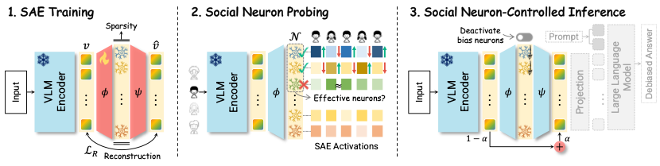

# Interpretable Debiasing of Vision-Language Models for Social Fairness (CVPR 2026)

Authors: [Na Min An](https://namin-an.github.io/)
[Yoonna Jang](https://yoonnajang.github.io/)
[Yusuke Hirota](https://www.y-hirota.com/)
[Ryo Hachiuma](https://ryohachiuma.github.io/)
[Isabelle Augenstein](https://isabelleaugenstein.github.io/)
[Hyunjung Shim](https://kaist-cvml.github.io/)

<br>

<a href="https://arxiv.org/abs/2602.24014"></a>

<p align="center" width="100%"></img></p>   

<br>

## Key Contributions

- 🔍 **Interpretable Internals**: The first interpretable debiasing framework to discover neurons highly responsive to specific social attributes.
- ⚙️ **Model-Agnostic Debiasing**: Applicable across different VLM architectures without full model retraining.
- ✅ **Bias Mitigation without Capability Degradation**: Selective neuron deactivation preserves general semantic understanding.

---

## Installation

This project is built and tested on the official [Pytorch Docker Image - 2.5.1-cuda12.4-cudnn9-devel](https://hub.docker.com/layers/pytorch/pytorch/2.5.1-cuda12.4-cudnn9-devel/images/sha256-14611869895df612b7b07227d5925f30ec3cd6673bad58ce3d84ed107950e014). 

```bash
git clone https://github.com/namin-an/DeBiasLens.git
cd DeBiasLens
pip install -r requirements_copenlu.txt
```

---

## Usage

### 1. Train Sparse Autoencoders

Train SAEs on facial image or caption datasets to uncover latent social attribute neurons.
Note that this is built upon the [sae-for-vlm](https://github.com/ExplainableML/sae-for-vlm) repository by supporting new datasets (`bios`, `celeba`, `cocogender`, `cocogendertxt`, `fairface`), model architecture (`InternViT-300M-448px`), and text encoder (`--probe_text_enc`).
Below is the example of training SAE on `fairface`  dataset for `clip-vit-large-patch14-336`. Please refer to the [scripts](scripts) for more details.

```bash
cd sae-for-vlm
export KAGGLEHUB_CACHE="<path/to/data>"
export WANDB_API_KEY="<your-wandb-api-key>"
export FAIRFACE_PATH="<path/to/data/fairface>"
DATASET_PATH="${FAIRFACE_PATH}"

# 1. Save original activations
for SPLIT in "train" "val"; do
  python save_activations.py \
    --batch_size 32 \
    --model_name "clip-vit-large-patch14-336" \
    --attachment_point "post_mlp_residual" \
    --layer 23 \
    --dataset_name "fairface" \
    --split "${SPLIT}" \
    --data_path "${DATASET_PATH}" \
    --num_workers 0 \
    --output_dir "./activations_dir/ours/random_k_2/fairface_${SPLIT}_activations_clip-vit-large-patch14-336_23_post_mlp_residual" \
    --random_k 2 \
    --save_every 100
done

# 2. Train SAE
python sae_train.py \
  --sae_model "matroyshka_batch_top_k" \
  --activations_dir "[your_working_path]/DeBiasLens/sae-for-vlm/activations_dir/raw/random_k_2/fairface_train_activations_clip-vit-large-patch14-336_23_post_mlp_residual" \
  --val_activations_dir "[your_working_path]/DeBiasLens/sae-for-vlm/activations_dir/raw/random_k_2/fairface_val_activations_clip-vit-large-patch14-336_23_post_mlp_residual" \
  --checkpoints_dir "checkpoints_dir/matroyshka_batch_top_k_20_x1/random_k_2/" \
  --expansion_factor 1 \
  --steps 110000 \
  --save_steps 20000 \
  --log_steps 10000 \
  --batch_size 4096 \
  --k 20 \
  --auxk_alpha 0.03 \
  --decay_start 109999 \
  --group_fractions 0.0625 0.125 0.25 0.5625
```

### 2 & 3. Localize Social Attribute Neurons & Debiased Inference

Identify neurons most responsive to specific demographic attributes and run VLM inference with targeted neuron deactivation.

😀 VLM DeBiasing
```bash
python ../evaluate.py \
--md_flag [sae_clip/clip-vitb16/clip-vitl14/debias_clip/siglip/blip-itm] \
--data [fairface/celeba/cocogender] \
--epoch [0/20000/40000/60000/80000/100000] \ # for sae_clip
```

😀 LVLM DeBiasing
```bash
cd vla-gender-bias
```

```bash
cd SB-Bench
```

```bash
cd VLMEvalKit
for a in 0.0 0.2 0.4 0.5 0.6 0.8 1.0; do 
    echo "alpha $a..."
    nohup python run.py \
    --data MME MMMU_DEV_VAL SEEDBench_IMG \
    --model [sae_intervl2_8b_attach/sae_llava_v1.5_7b_hf_attach] \
    --verbose \
    --alpha $a &> nohup_saeintern_attach.out
done
```
---

## Datasets

Please refer to `data/README.md` for instructions on downloading and preparing the datasets used in our experiments.

---

## Citation
Please consider citing our work if you find this work helpful for your research.

```
@article{an2026interpretable,
  title={Interpretable Debiasing of Vision-Language Models for Social Fairness},
  author={An, Na Min and Jang, Yoonna and Hirota, Yusuke and Hachiuma, Ryo and Augenstein, Isabelle and Shim, Hyunjung},
  journal={arXiv preprint arXiv:2602.24014},
  year={2026}
}
```

---

## Acknowledgements

We thank the teams behind the open-source code ([sae-for-vlm](https://github.com/ExplainableML/sae-for-vlm), [vla-gender-bias](https://github.com/ExplainableML/vla-gender-bias), [debias-vision-lang](https://github.com/oxai/debias-vision-lang), [SB-Bench](https://github.com/UCF-CRCV/BBQ-Vision)) that made this work possible. This research was conducted in collaboration across KAIST, the University of Copenhagen, and NVIDIA.
